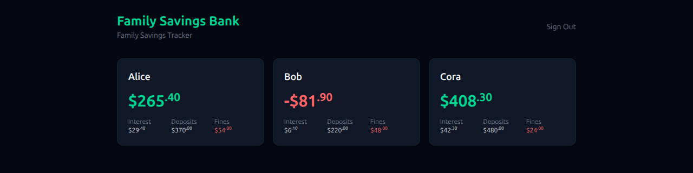
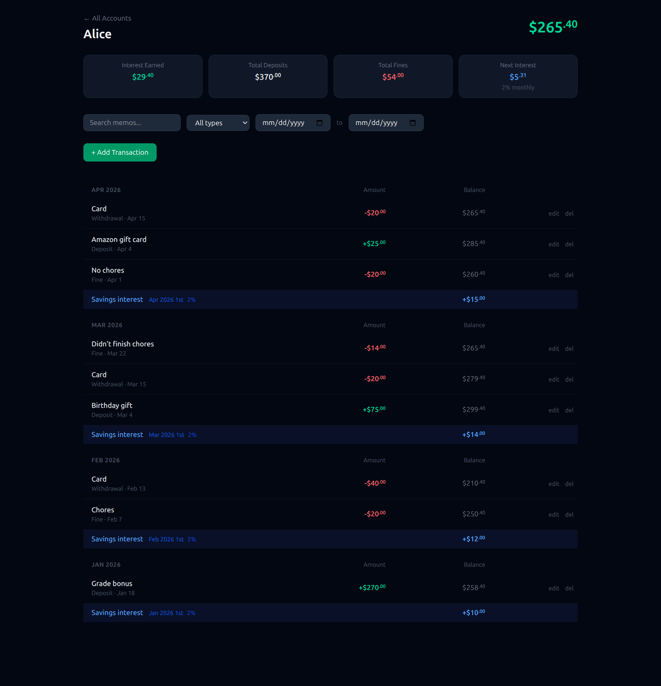

# Family Savings Bank

A self-hosted family savings tracker. Each child gets an account with deposits, withdrawals, fines, and automatic monthly compound interest — a hands-on way to teach kids how saving and compounding work.

Built on Firebase (Firestore + Auth + Cloud Functions + Hosting) with an Astro + Tailwind frontend. Deploy your own instance; nothing is tied to a specific family or project.

## Screenshots

| Dashboard | Account ledger |
|-----------|----------------|
| [](docs/screenshots/dashboard.png) | [](docs/screenshots/account-ledger.png) |

## Features

- **Per-child ledgers** with a running balance and lifetime totals (deposits, withdrawals, fines, interest).
- **Transactions**: deposit, withdrawal, or fine — each with a memo, amount, and an arbitrary (backdatable) date.
- **Automatic monthly compound interest** — a configurable rate applied on the 1st of each month, with an optional per-child override. Runs even in months with no activity.
- **Backdating** — insert a transaction with any past date; balances and monthly snapshots recompute automatically from that month forward.
- **Edit / delete** transactions, with recomputation on every write.
- **Role-based auth** — parents (admin, read/write) and children (read-only).
- **Search & filter** transactions by type and text.
- **Weekly deduplicated backups** to Cloud Storage.
- **Optional external API** — a static JSON summary (obfuscated IDs) for dashboards like Home Assistant.

## Tech Stack

| Layer | Choice |
|-------|--------|
| Frontend | Astro (static output) + Tailwind CSS v4 |
| Auth | Firebase Auth (email/password, custom claims for roles) |
| Database | Firestore |
| Backend | Firebase Cloud Functions (2nd gen, Node.js 22) |
| Hosting | Firebase Hosting |

## How It Works

### Data model

Interest is **not** stored as a transaction. It's derived from month-end balances and recorded in monthly snapshots. This makes backdating trivial: insert the transaction, then replay the monthly snapshots from the affected month forward.

```
settings/interest
  - defaultRate: number            (e.g. 0.02 = 2% monthly)

settings/api                       (optional; enables the external summary JSON)
  - summaryPath: string            (Storage object path used as a secret key)

accounts/{accountId}
  - name: string
  - order: number                  (dashboard sort order)
  - rateOverride: number | null    (per-child rate; falls back to defaultRate)
  - currentBalance: number         (cached — includes interest through current month)
  - totalInterest: number
  - totalDeposits: number
  - totalWithdrawals: number
  - totalFines: number
  - lastComputedAt: timestamp

accounts/{accountId}/transactions/{txId}
  - date: timestamp                (effective date — may be in the past)
  - memo: string
  - type: "deposit" | "withdrawal" | "fine"
  - amount: number                 (always positive; sign implied by type)
  - createdAt: timestamp           (audit: when the row was actually created)

accounts/{accountId}/monthly/{YYYY-MM}
  - startBalance: number           (prev month endBalance + interestEarned)
  - endBalance: number             (startBalance + net transactions this month)
  - interestRate: number           (rate in effect this month — the historical record)
  - interestEarned: number
  - totalDeposits / totalWithdrawals / totalFines: number
  - transactionCount: number
```

### Interest

- The rate for a month resolves as: account `rateOverride` → global `defaultRate`.
- `interestEarned = previous month endBalance * rate` (0 if the balance was negative).
- Interest is applied on the 1st and folded into the next month's `startBalance`, so it compounds — months of inactivity still grow the balance.
- Each monthly snapshot stamps the `interestRate` it used, so history stays accurate even after rate changes.

### Changing the rate

- **Global, going forward** — re-run `npx tsx scripts/init-settings.ts <rate>` (or edit `settings/interest.defaultRate`). The new rate applies to future monthly runs; already-recorded months keep the `interestRate` they were stamped with.
- **Per child** — set `accounts/{id}.rateOverride` to a number to override the global rate for that child, or `null` to fall back to it. There's no helper script; edit the field directly (e.g. in the Firestore console), then run `npx tsx scripts/recompute-all.ts` to rebuild snapshots and balances.
- **Retroactively, from a past month** — call the admin-only `changeRate` callable with `{ rate, effectiveMonth: "YYYY-MM", accountId? }` (omit `accountId` to change the global default). It updates the rate and recomputes every month from `effectiveMonth` forward. This function is deployed but not wired to the UI — invoke it from your own admin tooling, or use the manual edit + `recompute-all.ts` path above.

### The two snapshot states

1. **Created on the 1st** by the monthly cron: `startBalance` = previous month's `endBalance` + interest; `endBalance` starts equal to it. This is when interest is applied.
2. **Updated on each transaction** by the Firestore trigger: `endBalance` and totals are recalculated for the affected month and every month after it.

The current month always has a live snapshot reflecting all transactions so far.

### Cloud Functions

| Function | Trigger | Purpose |
|----------|---------|---------|
| `onTransactionCreated/Updated/Deleted` | Firestore write on `accounts/{id}/transactions/{txId}` | Recompute monthly snapshots from the affected month forward; update cached account totals; refresh the summary JSON. |
| `monthlyInterest` | Schedule `0 0 1 * *` (1st, midnight UTC) | Apply interest for the new month to every account; create its monthly snapshot; refresh the summary JSON. |
| `changeRate` | Callable (admin only) | Set the global default rate or a per-child override, effective from a given `YYYY-MM`, and recompute forward. |
| `weeklyBackup` | Schedule `0 0 * * 0` (Sundays, midnight UTC) | Export all data to the backups bucket, deduplicated by content hash. |
| `apiSummary` | HTTPS (`x-api-key` header) | On-demand JSON summary with obfuscated account IDs. |

### Dashboard reads

The dashboard never scans transaction history — it reads account docs (balances/totals) and the `monthly` subcollection (for charts). Only the ledger view queries `transactions`.

## Authentication & Roles

Firebase Auth with custom claims:

- **Parent** — `{ "role": "admin" }`: full read/write.
- **Child** — `{ "role": "child" }`: read-only. Children can view all accounts (there is no per-account restriction); writes are admin-only.

> **Note:** the Firebase Console has no button for custom claims — they can only be set programmatically. Use the `set-claims.ts` helper (see the [deploy walkthrough](#deploy-your-own-instance)). A user must sign out and back in after their role changes.

### Security rules

The shipped [firestore.rules](firestore.rules) enforce: authenticated admins read/write everything; authenticated children read everything; the `monthly` subcollection is written only by Cloud Functions (the Admin SDK bypasses rules). Storage rules ([storage.rules](storage.rules)) expose only `api/*` objects as public-read.

## Try It Locally (no cloud account needed)

You can run the whole app on your own computer using Firebase's emulators — no billing, no deploy. This is the fastest way to see what it does.

1. Install [Node.js](https://nodejs.org) (version 22 or newer) and the Firebase tools:
   ```bash
   npm install -g firebase-tools
   ```
2. Download the code and install dependencies:
   ```bash
   git clone <your-fork-url> family-savings-bank
   cd family-savings-bank
   npm install
   npm --prefix functions install
   ```
3. Create your local config from the examples (values here don't matter for the emulator):
   ```bash
   cp src/lib/firebase.ts.example src/lib/firebase.ts
   ```
4. Start everything with sample data:
   ```bash
   npm run dev:full
   ```
5. Open the address it prints (usually `http://localhost:4321`) and sign in with:
   - **Email:** `test@test.com`  **Password:** `test1234`

That test account and a few sample kids are created by `npm run seed`. Nothing here touches the cloud.

## Deploy Your Own Instance

This puts the app on the internet at `https://<your-project-id>.web.app`, with real accounts and automatic monthly interest. Follow the steps in order. Most of it is clicking through the Firebase website; a few steps are copy-paste terminal commands.

> **Heads up — this requires a paid billing plan.** Firebase's free "Spark" plan cannot run Cloud Functions, which this app needs for interest and backups. You must switch to the **Blaze (pay-as-you-go)** plan (step 2). For a single family's use, the actual cost is typically **$0–$1/month** — Blaze includes a large free tier — but a credit card is required and you should [set a budget alert](https://cloud.google.com/billing/docs/how-to/budgets) for peace of mind.

### Step 1 — Create the Firebase project

1. Go to the [Firebase Console](https://console.firebase.google.com) and sign in with a Google account.
2. Click **Add project**, give it a name, and finish the wizard. Google Analytics is optional (you can skip it).
3. Note your **Project ID** (shown under the project name, e.g. `smith-family-bank`) — you'll use it repeatedly below.

### Step 2 — Upgrade to the Blaze plan

In the console's left sidebar, click the plan name (bottom-left, likely "Spark") → **Upgrade** → choose **Blaze** and attach a billing account. Optionally set a budget alert.

### Step 3 — Turn on the services

In the Firebase Console left sidebar:

1. **Build → Firestore Database → Create database.** Choose a location close to you and start in **production mode** (rules from this repo will be deployed shortly).
2. **Build → Authentication → Get started → Sign-in method → Email/Password → Enable.**
3. **Build → Storage → Get started** (accept the default bucket). Needed for backups and the optional API summary.
4. *(Optional but recommended)* In **Firestore → (⋯) → Point-in-time recovery**, enable PITR for 7-day rollback.

### Step 4 — Register a Web App and copy its config

1. In the console, click the **gear icon → Project settings**.
2. Under **Your apps**, click the **`</>` (Web)** icon, give it any nickname, and register it. (Skip the "Firebase Hosting" checkbox here — we deploy hosting from the terminal.)
3. It shows a `firebaseConfig = { … }` block. Keep this tab open; you'll paste these values in step 6.

### Step 5 — Get the code and point it at your project

```bash
git clone <your-fork-url> family-savings-bank
cd family-savings-bank
npm install
npm --prefix functions install

cp .firebaserc.example .firebaserc
```

Open `.firebaserc` in a text editor and replace `your-project-id` with your actual Project ID from step 1.

### Step 6 — Add your configuration

```bash
cp src/lib/firebase.ts.example src/lib/firebase.ts
cp .env.example .env
```

- Open `src/lib/firebase.ts` and paste the values from step 4 (apiKey, authDomain, projectId, etc.). These are safe to expose publicly — access is controlled by the security rules.
- Open `.env` and set the app name shown in the UI and the installed app, e.g.:
  ```
  PUBLIC_APP_NAME="Smith Family Bank"
  PUBLIC_APP_SHORT_NAME="Smith Bank"
  PUBLIC_APP_TAGLINE="Family Savings Tracker"
  ```

### Step 7 — Log in and set the API secret

```bash
firebase login          # opens a browser to authorize the Firebase CLI
firebase functions:secrets:set API_KEY
```

`functions:secrets:set` prompts you to type a value — enter any long random string. **This step is required**, even if you don't plan to use the external API, because the code references the secret and the functions won't deploy without it. Save the value if you want to call the API later.

### Step 8 — Deploy

```bash
npm run deploy
```

This builds the site and deploys the security rules, database indexes, Cloud Functions, and hosting. The first functions deploy can take a few minutes and may ask permission to enable Google Cloud APIs — say yes. When it finishes it prints your live URL: `https://<your-project-id>.web.app`.

### Step 9 — Set up credentials for the admin scripts

The remaining steps run small scripts that write to your project (creating your admin login, accounts, etc.). They need permission to act as your project. The simplest way:

1. In the console: **gear → Project settings → Service accounts → Generate new private key.** This downloads a `.json` key file. **Keep it private — never commit it.**
2. In your terminal, point the scripts at it (adjust the path):
   ```bash
   export GOOGLE_APPLICATION_CREDENTIALS="/full/path/to/serviceAccountKey.json"
   export GCLOUD_PROJECT="your-project-id"
   ```
   These two lines apply to the current terminal session; set them again if you open a new terminal.

### Step 10 — Create your parent (admin) login

1. In the console: **Authentication → Users → Add user.** Enter your email and a password.
2. Grant yourself the admin role:
   ```bash
   npx tsx scripts/set-claims.ts you@example.com admin
   ```

### Step 11 — Set the interest rate and create accounts

```bash
npx tsx scripts/init-settings.ts 0.02            # 2% monthly interest (change as you like)
npx tsx scripts/create-account.ts alice "Alice"  # one command per child
npx tsx scripts/create-account.ts bob "Bob"
```

The account `id` (e.g. `alice`) appears in the URL; use lowercase, no spaces. To reorder the dashboard later: `npx tsx scripts/set-order.ts bob alice`.

### Step 12 — Open your bank

Visit `https://<your-project-id>.web.app`, sign in with the parent login from step 10, and start adding transactions. Interest is applied automatically on the 1st of each month.

**Adding a child's read-only login (optional):** create another user in **Authentication → Add user**, then run `npx tsx scripts/set-claims.ts kid@example.com child`.

## Backups (optional)

`weeklyBackup` runs every Sunday and exports all data to a separate Cloud Storage bucket named `<project-id>-backups`, writing a new snapshot only when something changed and keeping the most recent 52. To enable it, create the bucket once (Google Cloud Console → Cloud Storage → Create bucket; the Nearline storage class is plenty), or with the CLI:

```bash
gcloud storage buckets create gs://<project-id>-backups --location=us-central1 --default-storage-class=NEARLINE
```

Force a backup outside the schedule:

```bash
gcloud functions call weeklyBackup --project=<project-id> --region=us-central1 --gen2
```

**Restore:** download a snapshot from `gs://<project-id>-backups/snapshots/{date}.json`, write the documents back via the Admin SDK, then rebuild derived data:

```bash
GCLOUD_PROJECT=<project-id> npx tsx scripts/recompute-all.ts
```

Firestore's Point-in-Time Recovery (step 3) also covers accidental changes within the last 7 days.

## External API (optional)

Two independent mechanisms are available:

1. **Static summary JSON** — `writeSummary` writes an obfuscated summary to Cloud Storage on every transaction change and monthly run. Set `settings/api.summaryPath` to a hard-to-guess object path (e.g. `api/summary-<random>.json`); that path acts as the access key. The public URL is:
   ```
   https://firebasestorage.googleapis.com/v0/b/<project-id>.firebasestorage.app/o/{url-encoded-path}?alt=media
   ```
   Zero function invocations to read (served from the CDN with a 5-minute cache).

2. **`apiSummary` HTTPS function** — on-demand, gated by an `x-api-key` header matched against the `API_KEY` secret (set during [step 7](#step-7--log-in-and-set-the-api-secret)). Call its deployed URL with an `x-api-key: <your-secret>` header.

Both return obfuscated IDs (`child_0`, `child_1`, …), never real names:

```json
{
  "accounts": [
    { "id": "child_0", "balance": 363.52, "totalInterest": 348.32,
      "totalDeposits": 2487.13, "totalWithdrawals": 2238.93,
      "totalFines": 233.00, "interestRate": null }
  ],
  "totalBalance": 3699.08,
  "updatedAt": "2026-04-19T21:15:20.434Z"
}
```

### Home Assistant example

```yaml
sensor:
  - platform: rest
    name: Savings Bank
    resource: !secret savings_bank_api_url
    scan_interval: 3600
    value_template: "{{ value_json.totalBalance | round(2) }}"
    json_attributes:
      - accounts
      - updatedAt
```

## Scripts

Admin helpers that run against your live project. They need credentials — see [step 9](#step-9--set-up-credentials-for-the-admin-scripts) — then run with `npx tsx scripts/<name>.ts …`:

| Script | Purpose |
|--------|---------|
| `set-claims.ts <email> <admin\|child>` | Grant a user the parent (admin) or child role. |
| `init-settings.ts [rate]` | Set the global monthly interest rate (default `0.02`). |
| `create-account.ts <id> "<Name>"` | Create a child account with zeroed balances. |
| `set-order.ts [ids…]` | Set dashboard sort order (alphabetical by name if no IDs given). |
| `recompute-all.ts` | Rebuild all monthly snapshots and cached totals from transactions. |
| `seed-emulator.ts` | Seed the local emulator with a test admin and sample accounts (emulator only). |

> One-off, instance-specific scripts (data imports, ad-hoc comparisons) live in `scripts/local/`, and personal data files in `data/` — both gitignored.

## Project Structure

```
.
├── firebase.json            hosting / firestore / functions / storage / emulators config
├── .firebaserc              project ID (gitignored; see .firebaserc.example)
├── firestore.rules          security rules
├── firestore.indexes.json   composite indexes
├── storage.rules            Storage security rules
├── functions/src/
│   ├── index.ts             exports all functions
│   ├── transactionTrigger.ts
│   ├── monthlyCron.ts
│   ├── rateChange.ts
│   ├── recompute.ts         shared recomputation logic
│   ├── writeSummary.ts      static summary JSON writer
│   ├── backup.ts
│   └── apiSummary.ts
├── src/                     Astro frontend
│   ├── config.ts            branding (env-overridable)
│   ├── pages/               index, account, forgot-password, manifest.json.ts
│   ├── layouts/ styles/
│   └── lib/firebase.ts      client SDK init (gitignored; see .example)
├── public/                  static assets (icons, favicon)
├── scripts/                 admin helpers (scripts/local/ is gitignored)
└── data/                    instance-only data files (gitignored)
```

## License

MIT — see [LICENSE](LICENSE).
